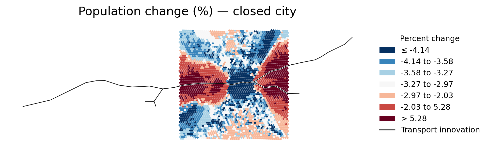
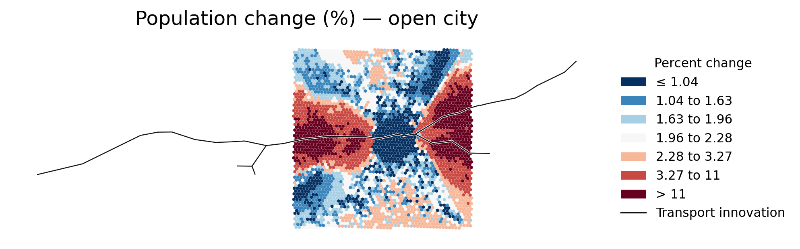
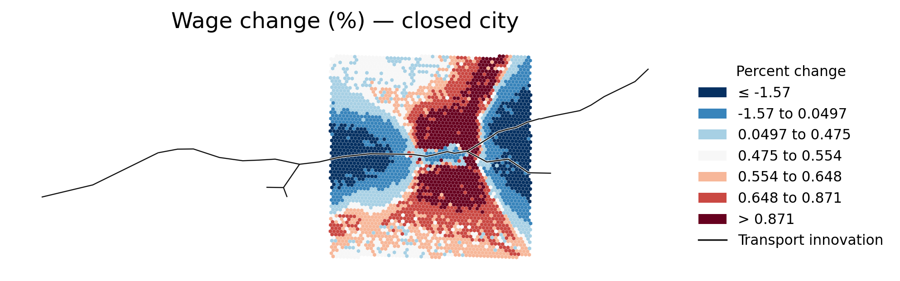
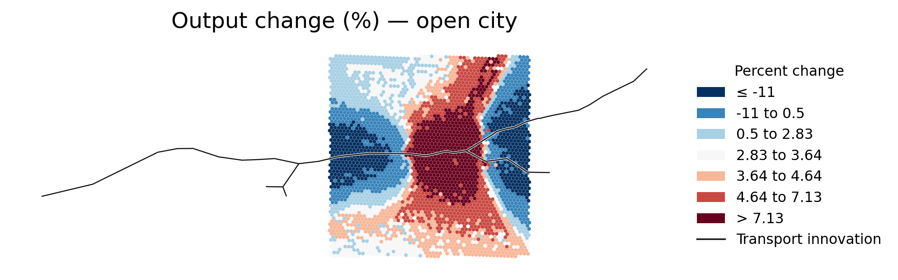

# QUETRANSPORT showcase

This showcase illustrates the outputs produced by one configured QUETRANSPORT
application. It is intended to make the workflow tangible before users prepare
their own data and scenarios.

> **Illustrative results only.** These values are generated by a particular
> dataset, transport intervention, parameterization, and set of modeling
> assumptions. They are not general estimates of transport-project effects and
> should not be interpreted as an appraisal of an actual project without
> validating the complete application.

## Example application

The example converts source data into **3,577 hexagonal model locations** with a
target cell size of 0.5 km. The baseline uses direct centroid-to-centroid travel
at the configured off-network speed. The counterfactual introduces a transport
network with **41 stations**. QUETRANSPORT then inverts the baseline economy and
solves the same intervention under closed- and open-city closures.

The black line in each map represents the transport innovation. Colors show the
percentage change from the model-consistent baseline in each location.

## Spatial results

### Population: closed city

Total population is fixed in the closed-city model. The map therefore shows
where residents relocate within the modeled city, not aggregate population
growth.

### Population: open city

In the open-city model, outside utility is fixed and total population can
adjust. Local population effects therefore combine within-city relocation with
net migration into or out of the city.

### Wages: closed city

Wage effects differ across locations as accessibility, commuting choices,
employment, and agglomeration forces adjust jointly.

### Output: open city

The output map shows how the transport intervention changes the spatial
distribution of economic activity when city population is allowed to adjust.

## Aggregate results

| City closure | Expected utility | Population | GDP/output | Total land rent |
|---|---:|---:|---:|---:|
| Closed | +1.013% | 0.000% | +0.897% | +0.897% |
| Open | approximately 0% | +5.406% | +5.631% | +5.631% |

These closure-specific outcomes answer different questions:

- In the **closed city**, aggregate population is fixed and expected utility
  adjusts.
- In the **open city**, outside utility is fixed and population adjusts through
  migration. The tiny reported utility deviation is numerical approximation.

The unrounded values are available in
[`aggregate_changes.csv`](aggregate_changes.csv).

## What a full run produces

QUETRANSPORT writes more than the selected examples displayed here:

- validation reports for geography, variables, and travel-time matrices;
- inverted baseline wages, productivity, amenities, and structural density;
- location-level baseline, counterfactual, and percentage-change tables;
- aggregate results for each requested city closure;
- maps of population, employment, wages, floor-space prices, and output; and
- MATLAB result files and convergence information for reproducibility and
  diagnosis.

See the [main QUETRANSPORT documentation](../README.md#outputs) for the complete
output structure and interpretation guidance.
